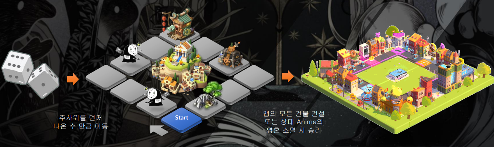

# 게임 방식

• 매칭을 통해 입장 후 턴 방식 진행&#x20;

• 주사위를 던저 나오는 합산으로 이동 / 두개의 주사위가 동일한 숫자가 나올경우 한번 더 주사위를 던질 수 있다.&#x20;

• 특정한 맵에 도착 시 건물의 건설 또는 Ka의 획득, 함정 및 타로카드 뽑기를 통해 진행이 된다.&#x20;

• 상대 Anima의 생명이 먼저 소진 되거나 맵의 마을을 먼저 살리는 자가 승리하게 된다.

